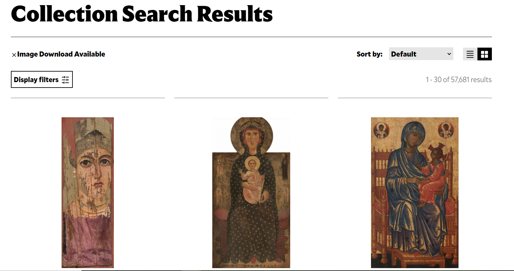
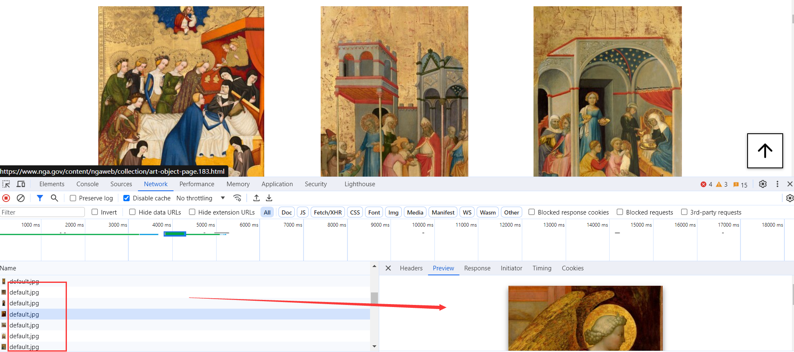
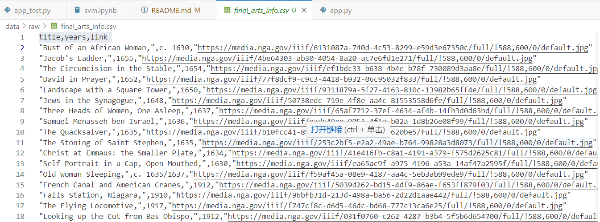
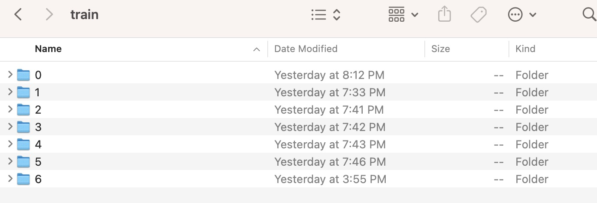
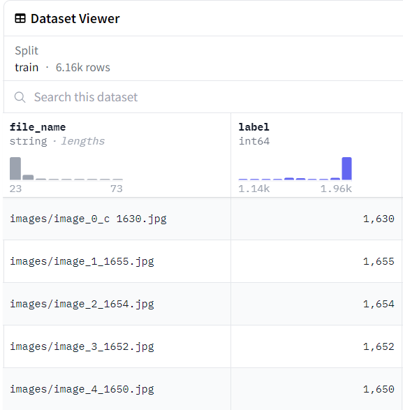
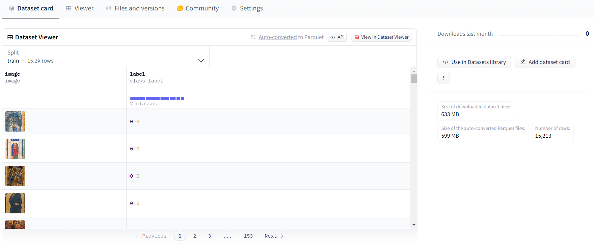
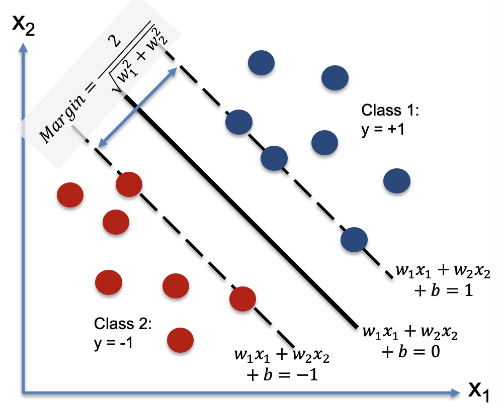
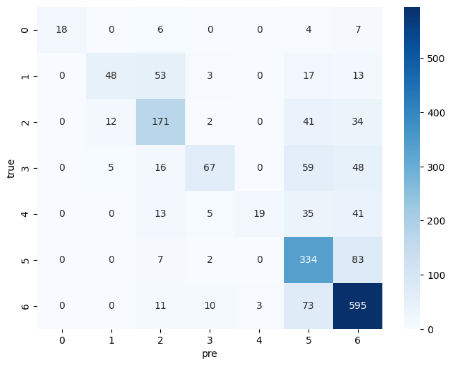
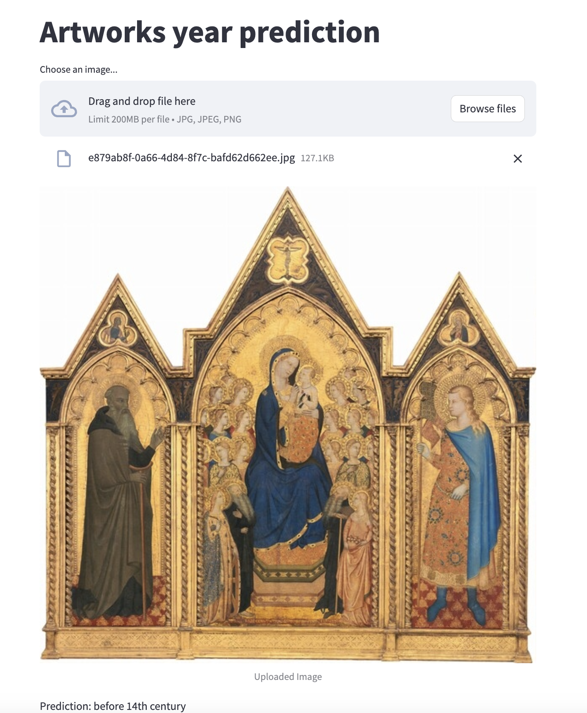

# Artwork_history_prediction

## Purpose
This project is going to collect the artworks images from [NGA](https://www.nga.gov/collection-search-result.html?sortOrder=DEFAULT&artobj_downloadable=Image_download_available&pageNumber=1&lastFacet=artobj_downloadable) and use these data to train/fine-tuning a computer vision model, which can predict the year of artwork. What's more, we provide a website user interface for testing.

## Features
- Scraped data from the NGA website.
- Building and fine-tuning a computer vision model for predicting the year of artwork.
- Providing a user-friendly graphical user interface (GUI) for users to upload images and obtain prediction results.
- Supporting various common types of artwork, such as paintings, sculptures, and photography.
- Offering detailed code and documentation for model training and prediction, facilitating further learning and customization.

## Prepare
### Environment Requirements
- Python 3.8+
- Required dependencies (see requirements.txt)

### Installation Steps
After you fork and git clone the project, You should do the following steps:
1. Prepare for the virtual environment `python -m venv venv`
2. Activate virtual environment.  Windows:`venv\Scripts\activate`, MacOS or Linux:`source venv/bin/activate`
3. Install required packages `pip install -r requirements.txt`

## Stages

### Data Collection and Preprocessing

1. Use a web scraper script based on `selenium` to collect artwork data from the NGA website (https://www.nga.gov/) and save it in an appropriate format, such as CSV. 

Due to the reason that NGA uses `JavaScript` and `Ajax` to generate content, using the `http.request` library will only retrieve the initial static HTML content and won't capture dynamically generated data. `Selenium`, by simulating user interactions with a browser, can load and execute JavaScript to retrieve the complete page content. Therefore, we get these images one by one using selenium.

2. Preprocess the scraped data, including image processing and data cleaning. Ensure that the images in the dataset align with their corresponding year labels.

    2.1.  Firstly, we got the csv file that includes header columns of title, years, link. 
    

    2.2 Clean them and got the corresponding label(year) with local image files'name

    2.3 Fetch the images and stored it into different label folders.
    

### Data Augmentation
Considering the unbalanced dataset, we adopt the **offline augmentation** method to enlarge the dataset. This method is suitable for smaller datasets. You will eventually increase the dataset by a certain multiple, which is equal to the number of conversions you make. For example, if I want to flip all my images, my dataset is equivalent to multiplying by 2.

**Before:**

**After:**

### Methodology
We did reszie, flip, random crop, rotation and colorJitter to the image to augment and get a larger dataset.
1.  `train_transform_1`:

-   `transforms.Resize((image_height, image_width))`: This transformation resizes the input image to the specified height and width. It's often used to standardize the size of input images for a neural network.

2.  `train_transform_2`:

-   `transforms.RandomHorizontalFlip()`: This randomly flips the image horizontally with a default 50% probability. It's useful for augmenting image datasets where the orientation isn't crucial.

3.  `train_transform_3`:

-   `transforms.RandomRotation(10)`: This randomly rotates the image by a degree selected from a uniform distribution within the range [-10, 10] degrees. It adds variability in terms of rotation, making the model more robust to different orientations.

4.  `train_transform_4`:

-   `transforms.RandomResizedCrop((image_height, image_width), scale=(0.8, 1.0), ratio=(0.9, 1.1))`: This applies a random resized crop to the image. It first randomly scales the image and then crops it to the specified size. The `scale` and `ratio` parameters control the variability in size and aspect ratio, respectively, of the crop.

5.  `train_transform_5`:

-   `transforms.ColorJitter(brightness=0.2, contrast=0.2, saturation=0.2, hue=0.1)`: This randomly changes the brightness, contrast, saturation, and hue of the image. The parameters control the degree of jittering for each attribute.

### Model Train

1. Machine Learning model - Support Vector Machine (SVM)

SVM works by finding the best possible line (hyperplane) that separates the data into two classes. By using the one vs all method, we can use SVM to classify multiple classes. We used the `sklearn` library to implement the SVM model. 

**SVM Model result**
1. F1 score: 0.66
2. Confusion Matrix:

2. Deep Learning model - VIT (Vision Transformer)

#### Model Comparison
| Model          | F1 score | Running Time |
|---------------|----------------------------------| -------------------|
| SVM     | 0.652   | 1:17:45 (20 epoch) |
| VIT    | 0.985  | 4:01 |

### Inference
We built a web interface using `streamlit`. You can input an image of an artwork, and it will attempt to predict the year in which the artwork was created.

The result of the prediction

